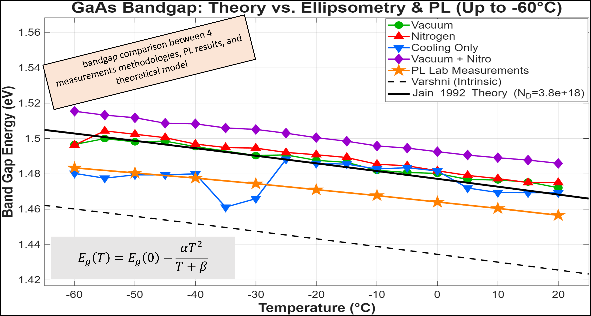
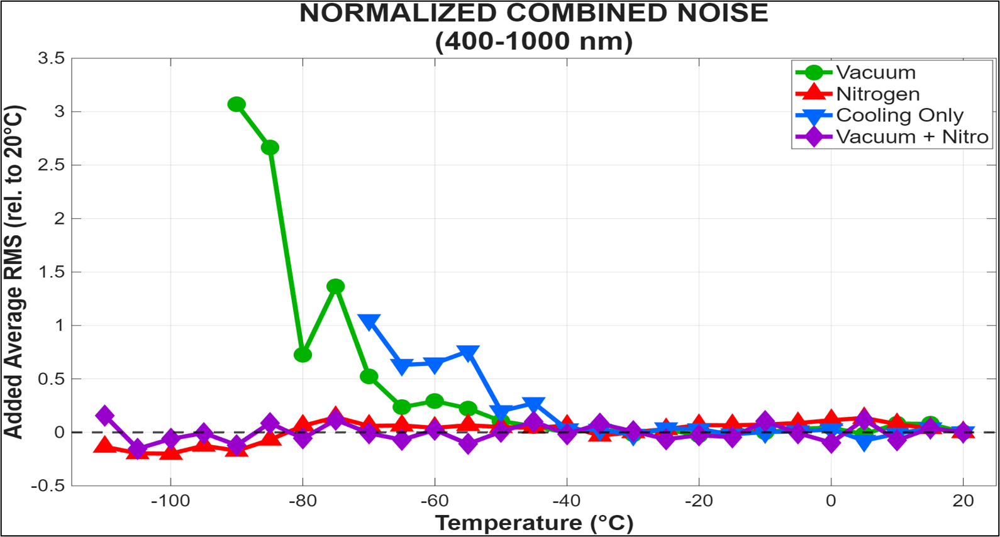

# Development and Integration of Optical Measurement Systems at Low Temperatures

**Project Number**: 25-1-1-3397  
**Authors**: Nadav Peer & Emad Mazzawi  
**Instructors**: Mor Feigenbaum Raz  
**Location**: Energy Devices Laboratory, Tel Aviv University  

## Project Overview

This repository contains the software, simulation models, and measurement analysis pipeline developed as part of our final project at Tel Aviv University. The central goal of the project was to develop, build, and integrate a measurement system for accurately characterizing the electro-optical properties of materials at very low temperatures (down to -100°C) using **Spectroscopic Ellipsometry**. 

Cooling the samples reduces thermal broadening (phonon interactions), allowing for much sharper detection of energy transitions and the identification of defect states ("traps") within the forbidden gap. This is crucial for optimizing advanced optoelectronic devices like solar cells and Photoelectrochemical (PEC) cells for green fuel production.

### Core Challenges and Solutions
Performing optical measurements at cryogenic temperatures introduces severe environmental challenges:
- **Moisture Condensation and Ice**: Scatters light and drastically increases measurement noise (RMS).
- **Stress-Induced Birefringence**: The vacuum and temperature gradients exert mechanical stress on the Linkam stage quartz windows, distorting the polarization of the incoming/outgoing light.

**Our Solution**: An integrative thermo-mechanical balance. By combining partial vacuum pumping with continuous dry Nitrogen purging, we successfully eliminated condensation and mitigated optical noise, allowing reliable extraction of optical constants down to -100°C.

## Key Results & Figures

### Energy Gap Simulation vs. Experimental Data
The plot below compares our theoretical bandgap models (Varshni and Jain 1992) with the experimental Tauc plot measurements obtained across different temperatures.

### Noise Comparison (RMS)
The signal noise was heavily influenced by the cooling environment. Below are the noise analysis results, demonstrating the optimal stability of the Nitrogen + Vacuum configuration.

## Repository Structure

### 1. `Energy Gap Simulation`
Contains theoretical models for bandgap calculation.
- **Key File**: `varshni_jain_theoritical.m`
- **Description**: Simulates the bandgap of GaAs across a wide temperature range. It calculates the intrinsic bandgap using the **Varshni Equation** and applies corrections for heavy n-doping ($N_d \approx 3.8 \times 10^{18} \text{ cm}^{-3}$) using the **Jain (1992) model**. This accounts for the Burstein-Moss shift (blue shift) and Bandgap Narrowing (BGN, red shift).

### 2. `Measurments Analysis Flow`
The core data processing pipeline for our ellipsometry results.
- **Key File**: `new_nitro_vacuum_master_code.m`
- **Description**: This master MATLAB script completely automates the analysis flow. It takes raw Ellipsometry data (Psi, Delta) and optical constants ($n, k$) extracted from the WVASE32 software.
- **Features**: 
  - Calculates the absorption coefficient ($\alpha$).
  - Evaluates signal noise (RMS) to identify failure points due to condensation or window stress.
  - Automatically generates **Tauc Plots**, computes derivatives to find the absorption edge, and extracts the experimental direct bandgap ($E_g$).
  - Compares experimental data to the theoretical Varshni and Jain models.

### 3. `Measurments Methods Comparison`
Used for comparing the optical stability and bandgap results across our four experimental cooling configurations:
1. Cooling Only
2. Cooling + Vacuum
3. Cooling + Nitrogen
4. Cooling + Vacuum + Nitrogen (The Optimal Setup)
- **Key File**: `compare_results.m`
- **Description**: Plots the extracted bandgaps from all configurations alongside independent Photoluminescence (PL) lab measurements and theoretical models. Contains the final status presentation (`מצגת סטטוס.pptx`).

### 4. `PL simulation`
Contains simulations for Photoluminescence (PL) spectra.
- **Key File**: `simulation2_2_7_24.m`
- **Description**: Calculates photon flux and simulates the PL emission spectrum of GaAs based on specific refractive indices and extinction coefficients.

### 5. `Photoelectrochemical Cells Measurments`
After calibrating the system on an n-GaAs reference, we applied our pipeline to novel research materials.
- **Description**: Contains data and analysis for PEC cells provided in collaboration with a research lab in Munich (models TAN202, TAO55, TAM21). We extracted their absorption coefficients to assist in SELE (Spatial External Luminescence Efficiency) depth-mapping of optical losses.

### 6. `Articles` & `Books And Guides`
Contains the project report, literature review, instrument guides (Linkam THMS600, J.A. Woollam WVASE32), and reference papers used during the research.

## How to Run the Code

The analysis and simulations are built entirely in **MATLAB**. 

1. **Full Analysis Pipeline**:
   - Navigate to `Measurments Analysis Flow/`.
   - Run `new_nitro_vacuum_master_code.m`.
   - The script will locate all raw `.xlsx` data files in the folder, process the Ellipsometry and Optical data, generate comprehensive figures (Tauc plots, Absorption spectra, n/k index plots), print the $E_g$ results to the console, and automatically save the figures in a `Saved_Figures` subfolder.

2. **Comparing Different Measurement Methods**:
   - Navigate to `Measurments Methods Comparison/`.
   - Ensure the respective `.mat` result files are present.
   - Run `compare_results.m`. This generates the master comparison plot of our different environmental setups and PL measurements vs. the Jain theoretical curve.

3. **Theoretical Model Only**:
   - Navigate to `Energy Gap Simulation/`.
   - Run `varshni_jain_theoritical.m` to plot the Varshni vs Jain 1992 theoretical curves.

4. **PL Spectrum Simulation**:
   - Navigate to `PL simulation/`.
   - Run `simulation2_2_7_24.m` to generate the predicted photoluminescence spectrum over a range of wavelengths.

## Acknowledgements
Special thanks to Tel Aviv University's Energy Devices Laboratory and our instructor, Mor Feigenbaum Raz, for their guidance and the opportunity to develop this system.
